<div align="center">

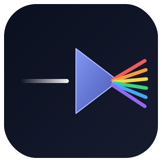

# Light

**A full-pipeline research skill pack — let AI walk a paper from idea to submission with you**

Every step of research, from literature search to rebuttal, has a dedicated skill · Works with Claude Code & Codex

**28 skills · 9 knowledge bases · 51 runnable scripts · 40 templates · 318 knowledge cards · never fabricates**

<br/>

[](LICENSE)
[](https://github.com/Light0305/Light-skills/actions/workflows/ci.yml)
[](#-skills-at-a-glance)
[](#-knowledge-bases)
[](#-install)
[](#-install)
[](CONTRIBUTING.md)

[简体中文](README.md) · **English**

</div>

---

## Contents

[What is Light](#what-is-light) · [Why use it](#why-use-it) · [Recommended setup](#-recommended-setup-best-experience) · [Quick start](#-install) · [Skills](#-skills-at-a-glance) · [Project flow](#a-full-project-flow) · [Case study](#-case-study) · [Figure gallery](#-figure-gallery) · [Knowledge bases](#-knowledge-bases) · [API keys](#-about-api-keys) · [FAQ](#-faq) · [Contributing](#-contributing) · [Citation](#-citation)

---

## What is Light

Light breaks the full research pipeline into **28 interlocking AI skills**, installed into your Claude Code and Codex. From finding literature, wrangling data, and generating ideas, to drafting papers, making figures, typesetting, submitting, and rebutting — plus patents, defense decks, and competition materials — every step has a dedicated skill, backed by 9 **traceable** knowledge bases.

It is not a pile of prompts, nor an MCP server or plugin — it is a **skill pack** installed into your client. Each skill ships **runnable scripts, reusable templates, and real worked examples**: external interfaces are tested for real, and statistics code is aligned with `scipy`/`sklearn` down to the last digit. **Never fabricating references, data, sources, or origins** is a line it won't cross.

> In one line: a senior research companion who genuinely knows the tools, installed into your editor.

## Why use it

Most "research AI" stops at chat. Light is different in three hard ways:

| | Ordinary prompt / assistant | **Light** |
|---|---|---|
| **Output** | A paragraph of advice | Runnable scripts + fillable templates + real examples |
| **Trust** | May fabricate refs, data, DOIs | Hard rule: never fabricate; the unverifiable is flagged |
| **Cohesion** | One-off answers, disjoint | 28 skills along one line, 9 shared knowledge bases |
| **Quality** | One pass | Adversarial self-check + authoritative cross-validation |
| **Memory** | Forgets on close | Cross-session project memory |
| **Continuity** | Re-explain everything when context breaks | Proactive handoff card + startup prompt; a fresh chat picks up seamlessly |

For: undergrads, grad students, and independent researchers who want to turn a project into a **real paper / copyright / patent / contest result** — especially anyone short on advisor support who needs a reliable companion across the whole pipeline.

### Compared to similar open-source skill packs

The ecosystem has several strong agent skill packs, each with its own focus. Light's edge is **not skill count** (it doesn't lead on numbers) but the **combination of forms** — a closed research throughline, self-maintained traceable knowledge bases, honesty mechanisms, bilingual pipeline, session handoff, and behavior evals, all at once:

| Dimension | **Light** | anthropics/skills | K-Dense scientific-agent-skills | ScienceIntelligence/ResearchSkills |
|---|---|---|---|---|
| **Closed throughline** | 28 skills close the research loop (search→data→idea→plan→experiment→analysis→writing→figures→submission→rebuttal; patents/PPT/contest in parallel) + orchestrator + checkpoint recovery | 17 skills, general doc/artifact tools, no research line | 146 skills (mostly library wrappers); multi-step pipelines but no fixed research-stage line | Organized by discipline, no end-to-end paper workflow |
| **Runnable assets** | 51 scripts all with offline selftest + 40 templates + code_assets verified digit-for-digit vs scipy/sklearn, CI-checked | scripts per skill, no unified offline self-test gate | 70+ Python packages, 100+ database integrations (wrapper route) | knowledge/methods + memory templates |
| **Knowledge bases** | 9 shared bases (318 cards, all traceable) | none | integrates 100+ external science databases (live query, not self-maintained cards) | no standalone base (knowledge lives in skills) |
| **Honesty mechanisms** | honesty floor in the conventions + 3-state citation/retraction checks + injection discipline + adversarial self-check | none seen in README | no anti-fabrication guardrails seen in README | none seen in README |
| **Chinese pipeline** | full bilingual line (Chinese venue search / GB/T 7714 / Chinese writing), CI guards it | none | no Chinese seen in README | has a Chinese README, but no end-to-end Chinese output pipeline |
| **Session handoff** | global handoff protocol (proactive seeding + card + startup prompt) + passive recovery | none | none seen in README | memory templates (memory-type, not a proactive cross-session handoff protocol) |
| **Behavior evals** | 44-task golden set + Tier1 baseline (48/48, 8/8 fabrication-bait red lines held) + monthly freshness automation | none | none seen in README | none |

<sub>Compared on **2026-06-12**, from each repo's README/tree (anthropics/skills `5754626` 17 skills · K-Dense `dab7aa6` 146 skills · ScienceIntelligence `ada6c05`). Competitors keep evolving; "none/not seen" means that repo's README/tree showed no such capability on that date — stating facts, not disparaging. Trail: [`_verification_log/R12-08-competitor-matrix.md`](_verification_log/R12-08-competitor-matrix.md).</sub>

### See it actually run

No filler demo GIF — here's the proof directly: a paper built **end-to-end with Light**, [`resampling-calibration-study`](projects/resampling-calibration-study/), walks search→idea→adversarial critique→real experiments→figures→a 6-page IEEE paper. [The PDF opens](projects/resampling-calibration-study/paper/main.pdf); the 9 figures are in the [gallery below](#-figure-gallery). Every number comes from a real run. A reproducible offline demo recording script for the skill scripts is at [`assets/demo.tape`](assets/demo.tape).

## 🏆 Recommended setup (best experience)

Light runs in any Claude Code / Codex environment; for the best experience, this combo:

| Item | Recommended | Notes |
|---|---|---|
| Harness | **Claude Code** / **Codex** | both one-command installs, skills auto-trigger |
| Model | **Claude Opus 4.8**, **GPT 5.5** | backup: DeepSeek V4 Pro etc. |
| Image model (strongly suggested) | any of **GPT Image 2** / **Nanobanana 2** / **Seedream 5.0** | unlocks the PPT image pipeline (`imggen-enhanced` mode of [`light-slides`](skills/light-slides/SKILL.md)); without it, falls back to the programmatic route |

> No image key, and every core feature still works. Add one, and your defense/pitch decks jump a tier. Generated images serve PPT/frontend visuals only — **never the paper-figure pipeline** (journal policy).

**🎨 PPT image pipeline.** The `imggen-enhanced` mode of [`light-slides`](skills/light-slides/SKILL.md) turns a `deck_spec.yaml` contract → image backend (OpenAI gpt-image / Gemini Nano Banana / Volcengine Seedream, one wrapper, no silent fake-success without a key) → real-data figure overlay → reassembled into an **editable pptx** (native text boxes/tables, no text baked into images). Without a key it auto-falls back to programmatic themed layouts; nothing is lost.

<details>
<summary><b>Known limits of low-tier / backup models</b></summary>

Low-tier / backup models (e.g. Claude Haiku or lightweight third-party models) hold the skills' honesty red lines (no fabrication, no overclaim, respect boundaries) — a direct payoff of writing red lines into SKILL text rather than relying on model judgment. But testing (2026-06-12, Haiku 4.5 on 8 fabrication-bait tasks, red lines 8/8 held) shows they lean toward "reciting the discipline" over "running scripts to produce evidence", and don't proactively question wrong premises a user gives (e.g. environment/state). **For heavy outputs or tasks needing multi-step real verification or proactive investigation, use a main-tier model (Opus 4.8 / GPT 5.5); low-tier fits light, single-step, clear-red-line tasks.** (Third-party backups like DeepSeek V4 Pro have no API in this environment and were not tested.)
</details>

## 🚀 Install

> Prereq: [Claude Code](https://claude.ai/code) or Codex installed, and `git` available.

> [!IMPORTANT]
> The 28 skills share the 9 knowledge bases and `code_assets/` at the repo root (via relative paths), so **keep the whole repo together**. The installer links the skills plus shared libraries into your client's skills directory — don't move a single skill out on its own.

**1. Clone** (anywhere):

```bash
git clone https://github.com/Light0305/Light-skills.git
cd Light-skills
```

> **GitHub is the only official source.** `github.com/Light0305/Light-skills` is Light's sole maintained source. Light is also listed on third-party skill marketplaces (e.g. skills.sh) for discoverability, but sync and integrity of any third-party-distributed copy are not guaranteed — install and update from this repo.

**2. Run the installer:**

```bash
# Windows (PowerShell)
powershell -ExecutionPolicy Bypass -File install.ps1            # both clients
powershell -ExecutionPolicy Bypass -File install.ps1 -Client claude   # Claude Code only

# macOS / Linux
./install.sh           # both clients
./install.sh claude    # a single client
```

Idempotent and re-runnable; links into Claude Code's `~/.claude/skills/` and Codex's `~/.agents/skills/`, and links `databases/`, `code_assets/` plus `CONVENTIONS.md`/`ROUTER.md`/`ROUTER_EXAMPLES.md`/`MODE_REGISTRY.md` as siblings so each skill's "see CONVENTIONS" references resolve after install.

> **Claude Code needs no routing snippet**: it auto-discovers skills from each `~/.claude/skills/<skill>/SKILL.md` frontmatter (`name`/`description`), unlike Codex which appends `AGENTS.snippet.md` to `~/.codex/AGENTS.md`. So the repo ships a snippet for Codex only; Claude Code works right after install.

**3. Restart your client and just ask:**

```
Do a literature review on this topic for me
Which venue should this paper go to?
Run significance tests on my results and make a publication-grade figure
```

Matching skills **trigger automatically** (matched to what you ask, no commands to memorize); or invoke any of the 17 manual skills by name with `/`. Codex needs one small extra step — see [.codex/INSTALL.md](.codex/INSTALL.md).

**Uninstall**: delete the links Light created under your client's skills directory; the source repo is untouched.

> ⚠️ **Windows users must delete directory links with `rmdir` (cmd)**: e.g. `rmdir "%USERPROFILE%\.claude\skills\light-xxx"`, `rmdir "%USERPROFILE%\.claude\databases"`. **Do NOT** use `Remove-Item -Recurse` or Explorer Shift+Del on a junction — that **follows the link through and deletes the source repo itself**. The shared docs (`CONVENTIONS.md` etc.) are hardlinks; remove that copy with `del` and the source is unaffected. A safe full uninstall script (checks ReparsePoint, uses `cmd /c rmdir`) is in [.codex/INSTALL.md](.codex/INSTALL.md). On macOS/Linux, `rm` on the symlink is fine.

## 🧭 Skills at a glance

The 28 skills split in two: **17 manual skills** you can invoke by name with `/`, which also trigger automatically on relevant tasks; and **11 always-on skills** that run in the background only (not in the `/` menu, but still working).

### Manual skills · along the research line (17)

| Stage | Skill | What it does |
|-------|-------|--------------|
| 📚 Literature | `light-literature-search` | Search multiple sources, dedup, judge credibility, rank importance, draft a review skeleton |
| 🧹 Data | `light-data-engineering` | Health-check data, split leakage-safe, enforce a quality gate, plan a custom dataset |
| 💡 Ideation | `light-idea-generation` ⇄ `light-idea-critique` | Propose ideas ↔ critique them adversarially through a reviewer's eyes, loop until solid |
| 🗺️ Planning | `light-research-plan` | Set the technical route, lay out an experiment matrix, judge feasibility, keep it reproducible |
| 📊 Analysis | `light-result-analysis` | Run EDA, test significance, compute effect sizes, trace anomalies, surface patterns |
| ✍️ Writing | `light-paper-drafting` ⇄ `light-paper-polishing` | Draft module by module ↔ polish logic, structure & language through a reviewer's eyes |
| 📈 Figures | `light-figure-planning` ⇄ `light-figure-drawing` | Plan what to chart and where ↔ draw it to publication spec per journal |
| 🔖 Cite & typeset | `light-citation` · `light-typesetting` | Verify DOIs, generate refs in any format · typeset in LaTeX/Word, export PDF |
| 📮 Submit & rebut | `light-venue-matching` · `light-review-rebuttal` | Target venues by tier (reach/safe/floor) · mock-review, rebut point by point |
| 🏆 Outputs | `light-ip-application` · `light-slides` · `light-competition` | Write patents/copyright · build defense & pitch decks (optional `imggen-enhanced` image pipeline) · prep contest materials |

### Always-on skills · background (11)

No need to invoke — they kick in automatically on relevant tasks and guard quality throughout:

| Skill | Role |
|-------|------|
| `light-file-reading` | Read PDF/Word/PPT/Excel/CSV/image/code/archives — understand structure, not just text |
| `light-memory-pm` | Cross-session project memory, stage breakdown, milestones & versions |
| `light-orchestrator` | Orchestrate ≥3-stage tasks into pipelines, checkpoints, and an artifact passport |
| `light-backend-coding` | Experiment/model/data/viz/backend code, TDD & systematic debugging |
| `light-system-design` | Architecture, database, API, auth, deployment design |
| `light-frontend-design` | Frontend UI & visualization dashboards, polished and demo-ready |
| `light-project-structure` | Standard project layout & naming, reproducible and tidy |
| `light-consistency` | Terms/metrics/claims aligned across paper·slides·copyright |
| `light-self-review` | Logic/facts/format/overclaim self-check before output |
| `light-tool-selection` | Pick the most fitting tool & method per task |
| `light-research-ethics` | Academic ethics, compliance, anti-fabrication floor |

## A full project flow

Skills aren't isolated tools — they hand off along one research throughline:

<p align="center">
  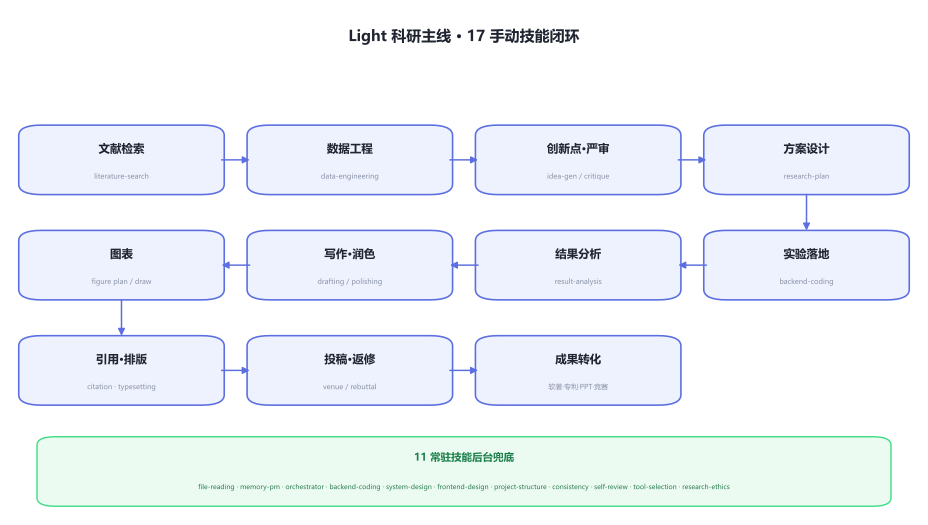
</p>

<details>
<summary>Plain-text flow (terminal-friendly)</summary>

```
kickoff → literature-search find direction & gaps → data-engineering health-check & leakage-safe split
        → idea-generation ⇄ idea-critique propose, adversarial critique, loop until solid
        → research-plan technical route & experiment matrix → backend-coding implement (TDD)
        → result-analysis significance + effect sizes + publication figures
        → paper-drafting ⇄ paper-polishing draft & polish
        → citation / figure-drawing / typesetting verify refs, render, typeset
        → venue-matching pick a venue → review-rebuttal rebuttal & revision
        → ip-application patents · slides defense deck (optional imggen image branch) · competition contest materials
```

</details>

Throughout, the 11 always-on skills backstop it: `file-reading` ingests any material, `memory-pm` remembers where you left off, `orchestrator` plans cross-stage pipelines, `consistency` keeps materials aligned, `self-review` self-checks before every output, `research-ethics` holds the integrity floor.

## 🔬 Case study

[**Resampling Silently Degrades Probability Calibration in Tree Ensembles**](projects/resampling-calibration-study/) is an end-to-end empirical study built with Light: literature search, idea generation, adversarial critique, real experiments, figures, and a **6-page IEEE-style paper**. **Every number comes from actual runs — no synthetic or invented results.**

<p align="center">
  <a href="projects/resampling-calibration-study/paper/main.pdf">
    
  </a><br>
  <sub>Click the first-page preview to open the full PDF · <a href="projects/resampling-calibration-study/paper/main.pdf">Read PDF</a> · <a href="projects/resampling-calibration-study/paper/main.tex">LaTeX source</a></sub>
</p>

- **5** OpenML datasets (imbalance ratio 1.9–70) · **2** tree ensembles · **7** conditions · **10** random seeds · paired statistical tests
- Core finding: resampling (SMOTE / over-sampling / under-sampling) can **systematically damage probability calibration**, while common headline metrics such as F1 and AUC barely move — the cost is hidden
- A simple post-hoc calibration step cuts ECE by roughly 66%, with only about 0.003 AUC loss

> The project also improved Light itself: it openly documents overlap with prior work and led to stronger novelty-collision checks in the idea, review, and self-review stages. See the [project README](projects/resampling-calibration-study/README.md) for the full trail.

## 📊 Figure gallery

One real dataset, nine different views — each chart tells one part of the story. See the [project README](projects/resampling-calibration-study/#-figure-gallery) for the full-size gallery.

<table>
  <tr>
    <td align="center" width="33%">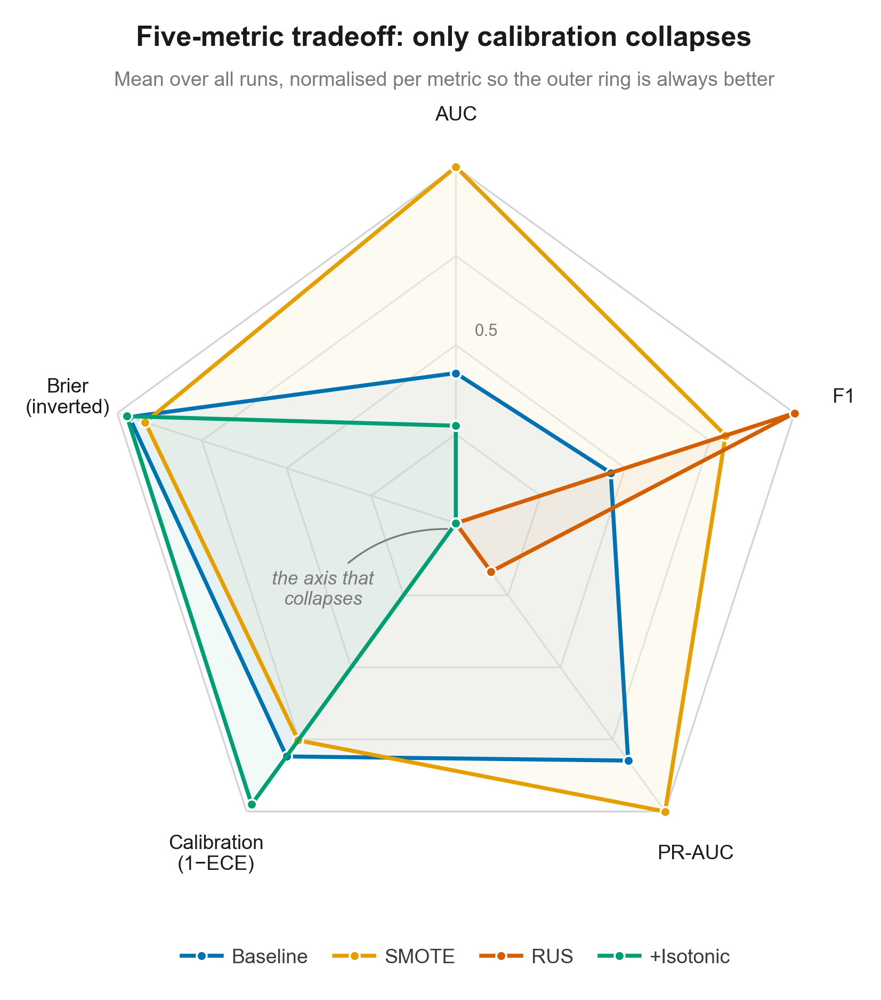<br><sub>🕸 Five-metric trade-off radar</sub></td>
    <td align="center" width="33%">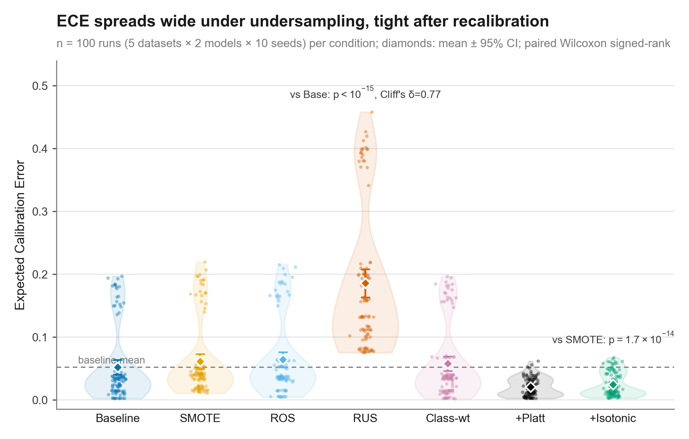<br><sub>🎻 ECE distribution violin</sub></td>
    <td align="center" width="33%">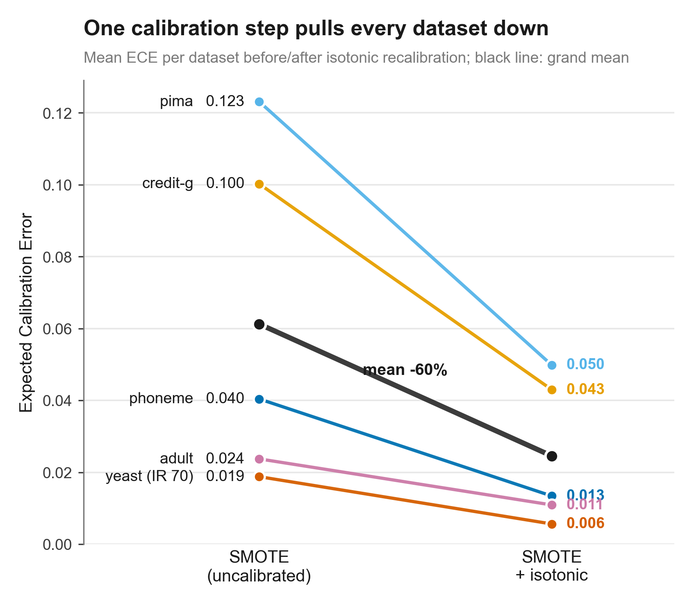<br><sub>📉 Calibration-repair slope chart</sub></td>
  </tr>
  <tr>
    <td align="center" width="33%">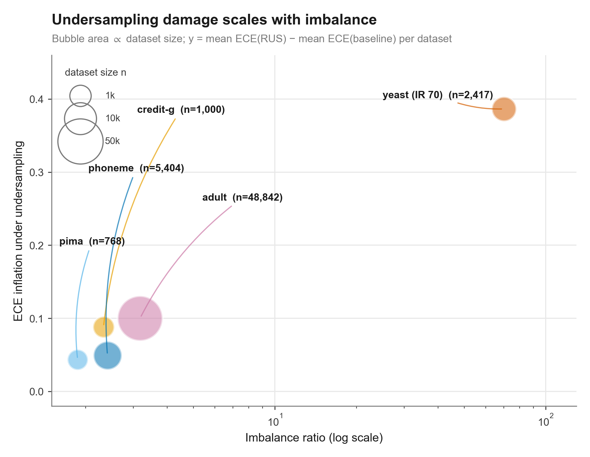<br><sub>🫧 Imbalance ratio × damage bubble</sub></td>
    <td align="center" width="33%">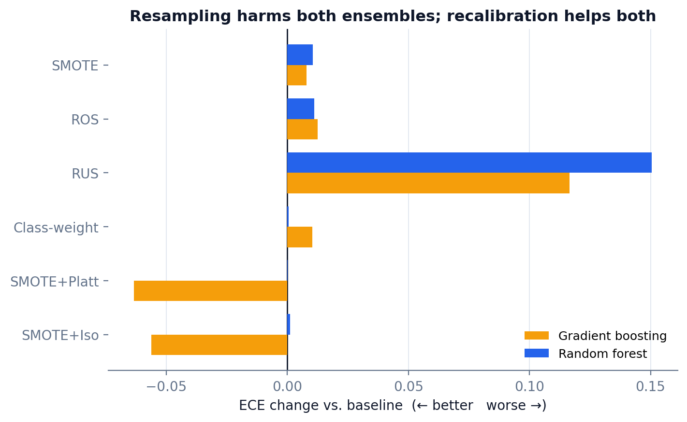<br><sub>↔️ Two-model diverging bars</sub></td>
    <td align="center" width="33%">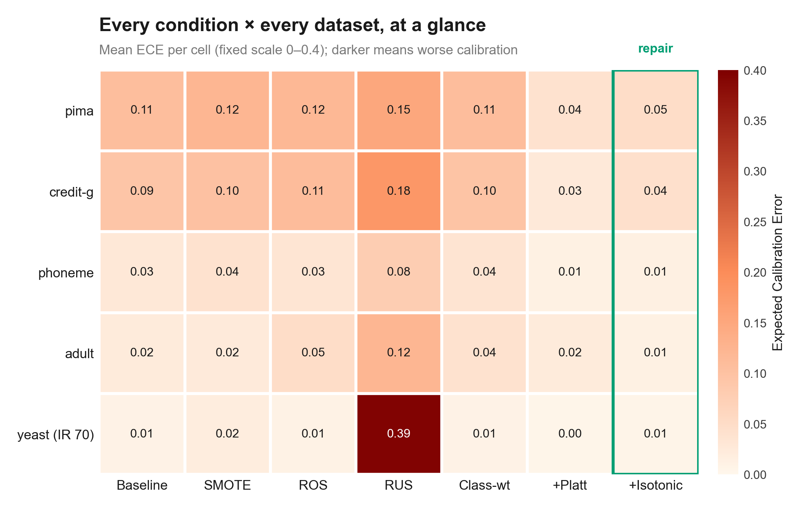<br><sub>🔥 Condition × dataset heatmap</sub></td>
  </tr>
  <tr>
    <td align="center" width="33%">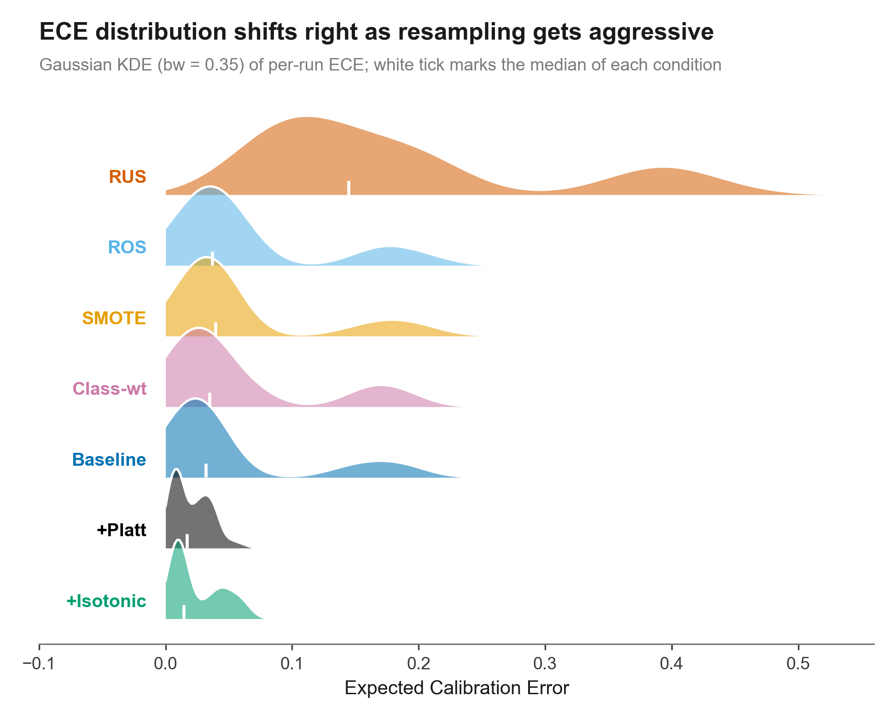<br><sub>🏔 ECE density ridgeline</sub></td>
    <td align="center" width="33%">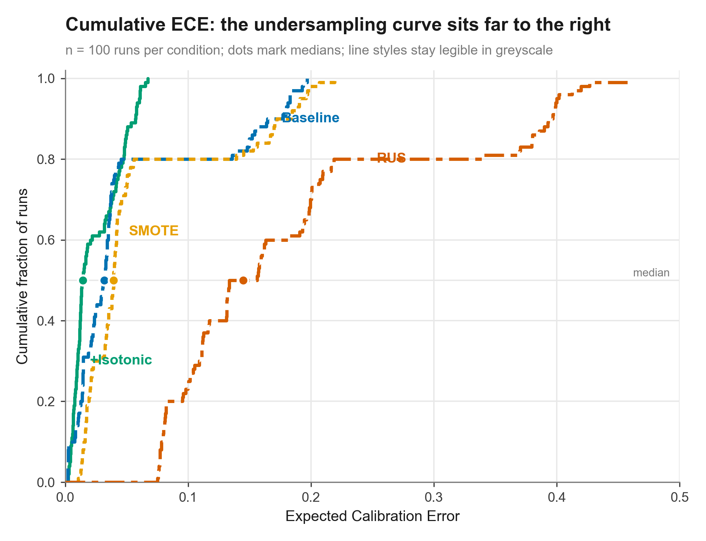<br><sub>📈 ECDF cumulative distribution</sub></td>
    <td align="center" width="33%">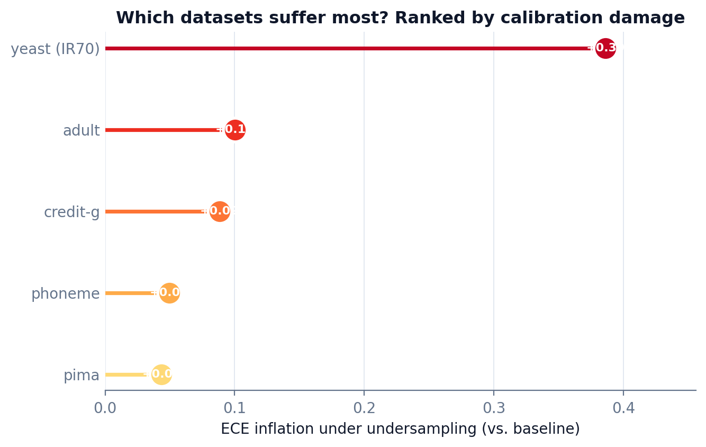<br><sub>🍭 Dataset damage ranking</sub></td>
  </tr>
</table>

## 📚 Knowledge bases

Behind the skills sit 9 shared knowledge bases (`databases/`), all verified and traceable:

| Base | Contents |
|------|----------|
| [`db01` venues](databases/db01-venues-templates/README.md) | Journal/conference metadata, review cycles, representative papers, tiers (real ISSNs + proxy metrics) |
| [`db02` templates](databases/db02-paper-writing/README.md) | Reusable templates for each pipeline stage |
| [`db03` methods](databases/db03-methods/README.md) | Method cards: task/IO/pros-cons/baselines/metrics/papers & repos |
| [`db04` datasets](databases/db04-datasets/README.md) | Dataset cards: scale/license/known issues/download |
| [`db05` design system](databases/db05-frontend-styles/README.md) | Frontend/visualization design specs |
| [`db06` slide themes](databases/db06-ppt-styles/README.md) | PPT themes & palettes |
| [`db07` figures](databases/db07-figures/README.md) | Top-venue figure cases: aesthetics/layout/palette/panel logic |
| [`db08` IP & contests](databases/db08-ip-materials/README.md) | Patents, contest material skeletons & rubric dimensions |
| [`db09` project state](databases/db09-projects/README.md) | Cross-session project memory: project cards/glossary/decision log |

Plus `code_assets/` — adversarially-verified statistics and metrics code (Cohen's κ/QWK vs `sklearn`, Welch t/BH-FDR/Wilson vs `scipy`, MOTA/IDF1, CORAL ordinal loss, long-tail resampling), aligned to authoritative libraries down to the last digit and continuously checked by CI.

## 🔑 About API keys

> [!NOTE]
> **Most features work out of the box with no API key.** Literature search defaults to the free, no-signup OpenAlex / Crossref.

Only one case needs your own key: **patent search** via `light-ip-application` calls commercial patent databases that require their own credentials. Light **never bundles or stores any key** — it only issues a request when you supply one.

| Service | Use | Required? | How to get |
|---------|-----|-----------|------------|
| OpenAlex / Crossref | Academic literature search | No key, default | No signup |
| [The Lens](https://www.lens.org/lens/user/subscriptions#scholar) | Patent↔paper linkage | Optional | Register; free for most academic use |
| [EPO OPS](https://developers.epo.org/) | European patent office data | Optional | Register for consumer key/secret |
| [USPTO ODP](https://developer.uspto.gov/) | US patent data | Optional | Register for an API key |

Provide keys via environment variables — never hard-code or commit them. See [SECURITY.md](SECURITY.md) for Light's security conventions.

## 🎯 Principles

- **Honesty first** — never invent references, data, sources, or origins; the unverifiable is clearly flagged "to be checked", verified is kept separate from inferred, and copyrighted material is stored as metadata and links only.
- **Runnable, not hand-wavy** — skills carry scripts that actually run, fillable templates, and complete examples, not paragraphs of abstract advice.
- **Adversarial self-check** — key outputs pass an independent "refute it" pass and cross-validation against trusted tools (statistics checked against `scipy`/`sklearn`, external interfaces tested for real).
- **Pipeline cohesion** — 28 skills hand off along one research throughline, sharing 9 knowledge bases for terminology, methods, and venue data.

## 🗂️ Layout

```
Light-skills/
├── skills/             # 28 skills, each with SKILL.md + references + scripts/templates/examples
├── databases/          # 9 knowledge bases (db01–db09)
├── code_assets/        # adversarially-verified stats & metrics code, CI-checked
├── projects/           # end-to-end showcase projects
├── evals/              # behavior eval golden set (44 tasks + Tier1 baseline, quarterly rolling)
├── _verification_log/  # secondary verification trail (API fields, tool behavior, source checks)
├── assets/             # logo, pipeline diagram, social preview (with reproducible generators)
├── install.ps1 / .sh   # one-command installer (idempotent)
├── CONVENTIONS.md      # global conventions (honesty floor, output norms)
├── ROUTER.md           # skill routing logic
├── ROUTER_EXAMPLES.md  # routing example regression set (continuation/recovery/figure boundaries)
├── AGENTS.snippet.md   # Codex routing block
├── .claude-plugin/     # Claude plugin manifest
├── .codex-plugin/      # Codex plugin manifest
├── CONTRIBUTING.md · CODE_OF_CONDUCT.md · SECURITY.md   # contribution/conduct/security
├── CHANGELOG.md · CITATION.cff · LICENSE                # changelog/citation/license
├── README.md · README.en.md                            # Chinese / English docs
├── .github/            # issue/PR templates, CI, funding config
└── .codex/INSTALL.md   # Codex install guide
```

## ❓ FAQ

<details>
<summary><b>What if a conversation gets too long and runs out of context?</b></summary>

Light has a **session handoff protocol**: when context is running low or a chunk of work wraps up, it proactively gives you two things — a self-contained handoff card written to the project's `.light/handoff/`, and a printed Chinese "new-conversation startup prompt". Copy the prompt, open a fresh conversation, paste it in, and the next Light picks up "where we are / what's next" by reading just the latest card — and can walk the handoff chain back to any parent conversation. The prompt's first line suggests naming the conversation like `[project] S04 ...` so your conversation list stays ordered. You can also trigger it anytime by saying "give me a handoff prompt".
</details>

<details>
<summary><b>How is this different from just chatting with ChatGPT/Claude?</b></summary>

Light gives runnable scripts, fillable templates, and real examples, with a hard "no fabrication" rule and adversarial self-check — plus cross-session project memory. Not one-off Q&A.
</details>

<details>
<summary><b>Do I need to configure an API key?</b></summary>

Most features need none — literature search defaults to the free OpenAlex / Crossref. Only patent search via `light-ip-application` needs your own Lens/EPO/USPTO credentials. See [About API keys](#-about-api-keys).
</details>

<details>
<summary><b>Why don't the always-on skills show up under <code>/</code>?</b></summary>

These 11 skills are designed to work in the background automatically, so they don't take up space in the `/` menu. The 17 manual skills work via `/` as usual.
</details>

<details>
<summary><b>Do I have to install both clients?</b></summary>

No. `install.ps1 -Client claude` or `install.sh claude` installs just one.
</details>

<details>
<summary><b>Will it upload my data to third parties?</b></summary>

No, unless the task requires it (e.g. searching public academic APIs). Operations that upload are surfaced. See [SECURITY.md](SECURITY.md).
</details>

<details>
<summary><b>Will Light write my paper or fabricate data for me?</b></summary>

No. It assists your research and expression but enforces academic ethics (`light-research-ethics`): no fabricated data, no invented references, no overclaiming.
</details>

## 🤝 Contributing

Bug fixes, new skills, knowledge-base entries, and docs are all welcome. Please read [CONTRIBUTING.md](CONTRIBUTING.md) and [CONVENTIONS.md](CONVENTIONS.md) (especially the honesty floor), and follow the [CODE_OF_CONDUCT.md](CODE_OF_CONDUCT.md). Report security issues privately per [SECURITY.md](SECURITY.md).

**Maintenance cadence.** Data-card freshness is checked monthly (1st of month) by `.github/workflows/freshness.yml`, which auto-opens a "data-card freshness checklist" issue when entries go stale; you can also trigger it manually via "Run workflow" in the Actions tab (GitHub stops scheduled runs on repos inactive for 60 days and disables schedules on forks by default, so the manual entry is the fallback). Skill **behavior** quality is guarded by `evals/` (golden tasks run quarterly to record a baseline; see [evals/README.md](evals/README.md)) — a deliberate split from the CI structure checkers: CI verifies "is the structure correct," evals verify "is the behavior good."

## ❤️ Support

Light is built and polished by one person in spare time. If it saves you time or makes research smoother, consider buying the author a coffee — your support is the biggest motivation for continued updates.

<div align="center">


*Scan with WeChat — any amount, the thought is what counts 🙏*
</div>

## 💬 Feedback

- **Bugs / feature requests** — open an [Issue](https://github.com/Light0305/Light-skills/issues) (bug / feature templates)
- **Usage & discussion** — head to [Discussions](https://github.com/Light0305/Light-skills/discussions)
- **Contributions** — fork and send a Pull Request
- **Email** — 1833058953@qq.com

## 📈 Star history

[](https://star-history.com/#Light0305/Light-skills&Date)

## 📌 Citation

If Light helps your research, cite it via [CITATION.cff](CITATION.cff), or click "Cite this repository" on the GitHub repo page.

## 📄 License

[MIT License](LICENSE) © 2026 Light

---

<div align="center">
<sub>Turn ideas into papers with Light · Made with care for researchers</sub>
</div>
