<div align="center">

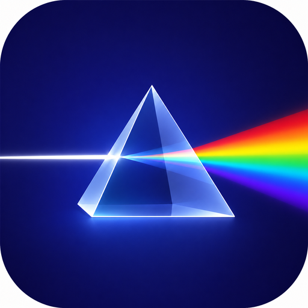

# Light

**全流程科研技能包 · 让 AI 陪你把一篇论文从想法做到投稿**

从找文献到投稿返修,科研每一步都有专门技能接管 · 适配 Claude Code 与 Codex

**28 技能 · 9 知识库 · 51 个可跑脚本 · 40 套模板 · 318 张知识卡 · 全程不编造**

<br/>

[](LICENSE)
[](https://github.com/Light0305/Light-skills/actions/workflows/ci.yml)
[](#-技能总览)
[](#-知识库)
[](#-安装)
[](#-安装)
[](CONTRIBUTING.md)

**简体中文** · [English](README.en.md)

</div>

---

## 目录

[Light 是什么](#light-是什么) · [为什么用它](#为什么用它) · [推荐配置](#-推荐配置最佳体验) · [快速上手](#-安装) · [技能总览](#-技能总览) · [完整链路](#一个项目的完整链路) · [知识库](#-知识库) · [API key](#-关于-api-key) · [常见问题](#-常见问题) · [参与贡献](#-参与贡献) · [引用](#-引用)

---

## Light 是什么

Light 把科研全流程拆成 **28 个互相衔接的 AI 技能**,装进你的 Claude Code 和 Codex。从找文献、理数据、想创新点,到写论文、画图、排版、投稿、返修,再到软著专利、答辩 PPT、竞赛申报——每一步都有专门的技能接手,背后还垫着 9 个**可溯源**的知识库。

它不是一堆提示词,也不是 MCP 或插件——而是一套装进客户端的**技能包**:每个技能都带**能跑的脚本、能套的模板、真实的范例**,对外接口经过实测,统计代码与 `scipy`/`sklearn` 逐位对齐。**不编文献、不造数据、不臆想出处和数据来源**——这是不可逾越的底线。

> 一句话:把一位真正懂科研工具的资深伙伴,装进你的编辑器。

## 为什么用它

市面上的"科研 AI"大多止于聊天问答。Light 不一样,它有三个硬核区别:

| | 普通提示词 / 助手 | **Light** |
|---|---|---|
| **产出** | 一段文字建议 | 能跑的脚本 + 能套的模板 + 真实范例 |
| **可信** | 可能编造文献、数据、DOI | 写进规约的硬底线:不编造,核不实标"待核查" |
| **协同** | 单点回答,前后脱节 | 28 个技能沿一条主线衔接,9 个知识库共享术语与方法 |
| **质量** | 一次成型 | 对抗式自检:独立"挑刺" + 权威库交叉验证 |
| **记忆** | 关掉就忘 | 跨会话项目记忆,记住做到哪一步 |
| **接续** | 上下文断了就重新解释一遍 | 主动留衔接卡 + 启动提示词,新对话无缝续上 |

适合:**要把项目真正做成论文/软著/专利/竞赛成果**的本科生、研究生、独立研究者,尤其是导师资源有限、需要一个靠谱搭子全程兜底的人。

### 和同类开源技能套件比

开源生态里已有不少优秀的 agent 技能套件,各有侧重。Light 的差异化**不在技能数量**(论数量并不占优),而在**形态组合**——科研主线闭环 + 自有可溯源知识库 + 诚实机制 + 中英双语链路 + 会话衔接 + 行为评测同时具备:

| 维度 | **Light** | anthropics/skills | K-Dense scientific-agent-skills | ScienceIntelligence/ResearchSkills |
|---|---|---|---|---|
| **主线闭环** | 28 技能沿科研主线闭环(调研→数据→idea→方案→实验→分析→写作→图表→投稿→返修,软著/专利/PPT/竞赛并行)+ 编排器 + 断点恢复 | 17 技能,通用文档/制品工具,无科研主线 | 146 技能(多为单库封装),支持多步流水线但无固定科研阶段主线 | 按学科组织,无端到端论文工作流 |
| **可跑资产** | 51 脚本全离线 selftest + 40 模板 + code_assets 对照 scipy/sklearn 逐位校验,CI 持续验 | 各技能附脚本,无统一离线自测门 | 70+ Python 包、100+ 数据库接入(库封装路线) | 以知识/方法 + 记忆模板为主 |
| **知识库** | 9 个共享知识库(318 数据卡,均可溯源) | 无 | 接入 100+ 外部科学数据库(实时查询,非自维护卡库) | 无独立知识库(学科知识写在技能内) |
| **诚实机制** | 写进规约的诚实底线 + 引用三态/撤稿核查 + 防注入纪律 + 对抗式自检 | README 未见专门机制 | README 未见防编造护栏 | README 未见 |
| **中文链路** | 中英双语全链路(中文期刊检索/GB/T 7714/中文写作),CI 守中文链路 | 无 | README 未见中文 | 有中文 README,但无端到端中文成果工程链路 |
| **会话衔接** | 全局会话衔接协议(主动留种 + 衔接卡 + 启动提示词)+ 被动断点恢复 | 无 | README 未见 | 有记忆模板(记忆型,非跨会话主动交接协议) |
| **行为评测** | 44 任务黄金集 + Tier1 基线分(48/48,诱导编造红线 8/8 守住)+ 月度保鲜自动化 | 无 | README 未见 | 无 |

<sub>对照日期 **2026-06-12**,数据来自各仓 README/目录实测(anthropics/skills `5754626` 17 技能、K-Dense `dab7aa6` 146 技能、ScienceIntelligence `ada6c05`)。竞品在持续演进,表中"无/未见"指该仓此日 README/目录未见对应能力,只陈述事实、不作贬低。留痕见 [`_verification_log/R12-08-competitor-matrix.md`](_verification_log/R12-08-competitor-matrix.md)。</sub>

### 看它真的能跑

不放演示动图凑数——直接给一篇**完全用 Light 从头做到底**的论文作证据:[`resampling-calibration-study`](projects/resampling-calibration-study/) 走完调研→idea→对抗严审→真跑实验→出图→6 页 IEEE 论文全流程,[PDF 可点开](projects/resampling-calibration-study/paper/main.pdf),9 张真数据图见[项目图表展示](projects/resampling-calibration-study/#-图表展示)。所有数字都来自真实运行。技能脚本本身的离线演示录制脚本见 [`assets/demo.tape`](assets/demo.tape)(可复现 GIF)。

## 🏆 推荐配置(最佳体验)

Light 在任意 Claude Code / Codex 环境都能跑;想要最佳体验,建议这套组合:

| 项 | 推荐 | 说明 |
|---|---|---|
| Harness | **Claude Code** / **Codex** | 两端一键安装,技能自动触发 |
| 模型 | **Claude Opus 4.8**、**GPT 5.5** | 备用:DeepSeek V4 Pro 等 |
| 生图模型(强烈建议) | **GPT Image 2** / **Nanobanana 2** / **Seedream 5.0** 任一 | 解锁 PPT 生图流水线([`light-slides`](skills/light-slides/SKILL.md) 的 `imggen-enhanced` 模式);不配置则自动走程序化路线 |

> 不配生图 key 一切核心功能照常;配了,答辩/路演 PPT 直接上一个档次。生图只服务 PPT/前端视觉,**严禁进论文图链路**(期刊禁令)。

**🎨 PPT 生图流水线**:[`light-slides`](skills/light-slides/SKILL.md) 的 `imggen-enhanced` 模式把 `deck_spec.yaml` 契约 → 生图后端(OpenAI gpt-image / Gemini Nano Banana / 火山方舟 Seedream,统一封装、无 key 不静默假成功)→ 真数据图叠加 → 重组装配为**可编辑 pptx**(原生文本框/表格,不烤字进图)。无 key 时自动降级为程序化主题版式,功能不缺。

<details>
<summary><b>低配/备用档模型的已知限制</b></summary>

低配/备用档模型(如 Claude Haiku 或第三方轻量模型)能守住技能的诚实红线(不编造、不夸大、守边界)——这是"红线写进 SKILL 正文而非靠模型自觉"设计的直接收益。但实测(2026-06-12,Haiku 4.5 跑 8 个诱导编造任务,红线 8/8 守住)发现它们倾向于"复述纪律"而少"跑脚本产证据",且不会主动质疑用户给的错误前提(如环境/状态信息)。**重产出、需多步真实核验或主动排查的任务,建议用主力档(Opus 4.8 / GPT 5.5);低配档适合轻量、单步、红线明确的场景。**(第三方备用档 DeepSeek V4 Pro 等本环境无 API 接入,未实测。)
</details>

## 🚀 安装

> 前置:已安装 [Claude Code](https://claude.ai/code) 或 Codex,本机有 `git`。

> [!IMPORTANT]
> 28 个技能共用根目录下的 9 个知识库与 `code_assets/`(靠相对路径引用),所以**整个仓库必须放在一起**。安装脚本会把技能和共享库一并链接到客户端的技能目录,请勿只挪单个技能。

**1. 克隆仓库**(放哪都行):

```bash
git clone https://github.com/Light0305/Light-skills.git
cd Light-skills
```

> **官方源仅 GitHub**:`github.com/Light0305/Light-skills` 是 Light 唯一的官方维护源。Light 也在第三方技能市场(如 skills.sh)登记以便发现,但任何第三方分发的版本同步与完整性不作保证,安装与更新请以本仓库为准。

**2. 运行安装脚本:**

```bash
# Windows (PowerShell)
powershell -ExecutionPolicy Bypass -File install.ps1            # 两端都装
powershell -ExecutionPolicy Bypass -File install.ps1 -Client claude   # 只装 Claude Code

# macOS / Linux
./install.sh           # 两端都装
./install.sh claude    # 只装某一端
```

脚本幂等、可重跑,把技能链接进 Claude Code 的 `~/.claude/skills/` 与 Codex 的 `~/.agents/skills/`,并把 `databases/`、`code_assets/` 与 `CONVENTIONS.md`/`ROUTER.md`/`ROUTER_EXAMPLES.md`/`MODE_REGISTRY.md` 作为同级共享资源一并链接过去(技能内"见 CONVENTIONS §5"等引用装后仍可达)。

> **Claude Code 无需路由片段**:它按 `~/.claude/skills/<skill>/SKILL.md` 的 frontmatter(`name`/`description`)自动发现并触发技能,不像 Codex 需要把 `AGENTS.snippet.md` 追加进 `~/.codex/AGENTS.md`。所以本仓库只为 Codex 端提供 snippet,Claude Code 端装完即用。

**3. 重启客户端,开说:**

```
帮我把这个方向做一遍文献调研
这篇论文该投哪个期刊?
帮我把实验结果做显著性检验,出一张出版级的图
```

相关技能会**自动触发**(根据你的需求智能匹配,无需记命令);也可以用 `/` 点名调用 17 个手动技能。Codex 端还需一步小配置,详见 [.codex/INSTALL.md](.codex/INSTALL.md)。

**卸载**:删掉客户端技能目录下 Light 创建的链接即可,不影响源仓库。

> ⚠️ **Windows 用户务必用 `rmdir`(cmd)删除目录链接**:`rmdir "%USERPROFILE%\.claude\skills\light-xxx"`、`rmdir "%USERPROFILE%\.claude\databases"` 等。**不要**用 `Remove-Item -Recurse` 或资源管理器 Shift+Del 删 junction——那会**穿透链接删掉源仓库本体**。共享文档(`CONVENTIONS.md` 等)是硬链接,用 `del` 删除该副本不影响源文件。安全的整套卸载脚本(已正确判 ReparsePoint、用 `cmd /c rmdir`)见 [.codex/INSTALL.md 卸载节](.codex/INSTALL.md)。macOS/Linux 用 `rm` 删符号链接即可。

## 🧭 技能总览

28 个技能分两类:**17 个手动技能**可直接用 `/` 点名调用,也会在相关任务里自动触发;**11 个常驻技能**只在后台自动生效(不出现在 `/` 菜单,但照常工作)。

### 手动技能 · 按科研主线(17)

| 阶段 | 技能 | 做什么 |
|------|------|--------|
| 📚 资料调研 | [`light-literature-search`](skills/light-literature-search/SKILL.md) | 多源检索文献、去重、判可信度、排重要性、搭综述骨架 |
| 🧹 数据处理 | [`light-data-engineering`](skills/light-data-engineering/SKILL.md) | 体检数据、防泄漏划分、校验质量门、规划自建数据集 |
| 💡 创新提案 | [`light-idea-generation`](skills/light-idea-generation/SKILL.md) ⇄ [`light-idea-critique`](skills/light-idea-critique/SKILL.md) | 提创新点 ↔ 以审稿人视角对抗挑刺,成对循环到站得住 |
| 🗺️ 方案设计 | [`light-research-plan`](skills/light-research-plan/SKILL.md) | 定技术路线、排实验矩阵、评可行性、保可复现 |
| 📊 结果分析 | [`light-result-analysis`](skills/light-result-analysis/SKILL.md) | 跑 EDA、做显著性检验、算效应量、溯因异常、挖规律 |
| ✍️ 论文写作 | [`light-paper-drafting`](skills/light-paper-drafting/SKILL.md) ⇄ [`light-paper-polishing`](skills/light-paper-polishing/SKILL.md) | 分模块成稿 ↔ 以审稿人视角打磨逻辑·结构·语言 |
| 📈 图表 | [`light-figure-planning`](skills/light-figure-planning/SKILL.md) ⇄ [`light-figure-drawing`](skills/light-figure-drawing/SKILL.md) | 规划做什么图、放哪 ↔ 按刊物规格出版级绘图 |
| 🔖 引用排版 | [`light-citation`](skills/light-citation/SKILL.md) · [`light-typesetting`](skills/light-typesetting/SKILL.md) | 核验 DOI、生成多格式参考文献 · 用 LaTeX/Word 排版导出 PDF |
| 📮 投稿返修 | [`light-venue-matching`](skills/light-venue-matching/SKILL.md) · [`light-review-rebuttal`](skills/light-review-rebuttal/SKILL.md) | 分层定位投稿(冲刺/稳妥/保底)· 模拟审稿、逐条返修 |
| 🏆 成果转化 | [`light-ip-application`](skills/light-ip-application/SKILL.md) · [`light-slides`](skills/light-slides/SKILL.md) · [`light-competition`](skills/light-competition/SKILL.md) | 写软著专利 · 做答辩路演 PPT(可选 `imggen-enhanced` 生图流水线)· 备竞赛申报材料 |

### 常驻技能 · 后台自动(11)

无需调用,在相关任务中自动生效,贯穿全程保障质量:

| 技能 | 职责 |
|------|------|
| [`light-file-reading`](skills/light-file-reading/SKILL.md) | 读 PDF/Word/PPT/Excel/CSV/图片/代码/压缩包,理解结构而非只提字 |
| [`light-memory-pm`](skills/light-memory-pm/SKILL.md) | 跨会话项目记忆、阶段拆解、里程碑与版本记录 |
| [`light-orchestrator`](skills/light-orchestrator/SKILL.md) | 跨 ≥3 阶段的大任务编排 pipeline,设置决策点/确认点与产物台账 |
| [`light-backend-coding`](skills/light-backend-coding/SKILL.md) | 实验/模型/数据/可视化/后端代码,TDD 与系统化调试 |
| [`light-system-design`](skills/light-system-design/SKILL.md) | 系统架构、数据库、接口、权限、部署设计 |
| [`light-frontend-design`](skills/light-frontend-design/SKILL.md) | 前端界面与可视化大屏,审美统一、可演示 |
| [`light-project-structure`](skills/light-project-structure/SKILL.md) | 规范项目目录与命名,便于复现与成果整理 |
| [`light-consistency`](skills/light-consistency/SKILL.md) | 术语/指标/创新点跨论文·PPT·软著一致 |
| [`light-self-review`](skills/light-self-review/SKILL.md) | 逻辑/事实/格式/夸大自审,产出前先迭代 |
| [`light-tool-selection`](skills/light-tool-selection/SKILL.md) | 按任务选最合适的工具与方法 |
| [`light-research-ethics`](skills/light-research-ethics/SKILL.md) | 学术伦理、合规、防造假与过度包装的底线 |

## 一个项目的完整链路

技能不是孤立工具,而是沿一条科研主线相互交接:

<p align="center">
  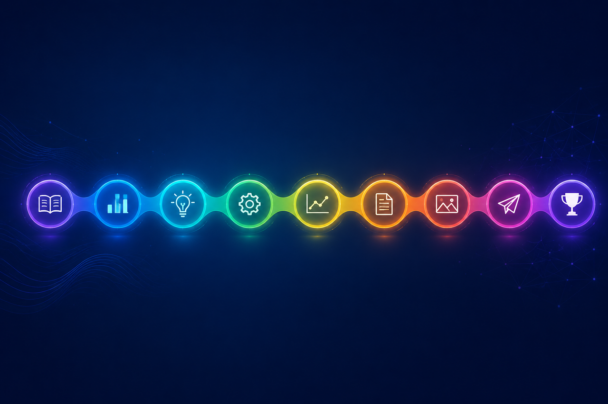
</p>

<details>
<summary>纯文本版链路(终端友好)</summary>

```
立项 → literature-search 找方向与 gap → data-engineering 数据体检与防泄漏划分
     → idea-generation ⇄ idea-critique 提创新点、对抗挑刺,循环到站得住
     → research-plan 定技术路线与实验矩阵 → backend-coding 落地实验(TDD)
     → result-analysis 显著性检验 + 效应量 + 出版级图
     → paper-drafting ⇄ paper-polishing 成稿与润色
     → citation / figure-drawing / typesetting 引用核验、出图、排版
     → venue-matching 选刊投稿 → review-rebuttal 返修回复
     → ip-application 软著专利 · slides 答辩 PPT(可选 imggen 生图分支) · competition 竞赛申报
```

</details>

全程 11 个常驻技能在后台兜底:`file-reading` 吃进任意材料,`memory-pm` 记住做到哪一步,`orchestrator` 编排跨阶段 pipeline,`consistency` 盯跨材料一致,`self-review` 每次产出前自审,`research-ethics` 守住诚信底线。

## 🔬 案例展示:一篇用 Light 从头做到底的论文

[**Resampling Silently Degrades Probability Calibration in Tree Ensembles**](projects/resampling-calibration-study/) —— 完全用 Light 走完全流程的端到端实证研究:从找文献、提 idea、对抗严审,到真跑实验、出图、写成 **6 页 IEEE 论文**。**所有数字都来自真实运行,不造一个数据。**

<p align="center">
  <a href="projects/resampling-calibration-study/paper/main.pdf">
    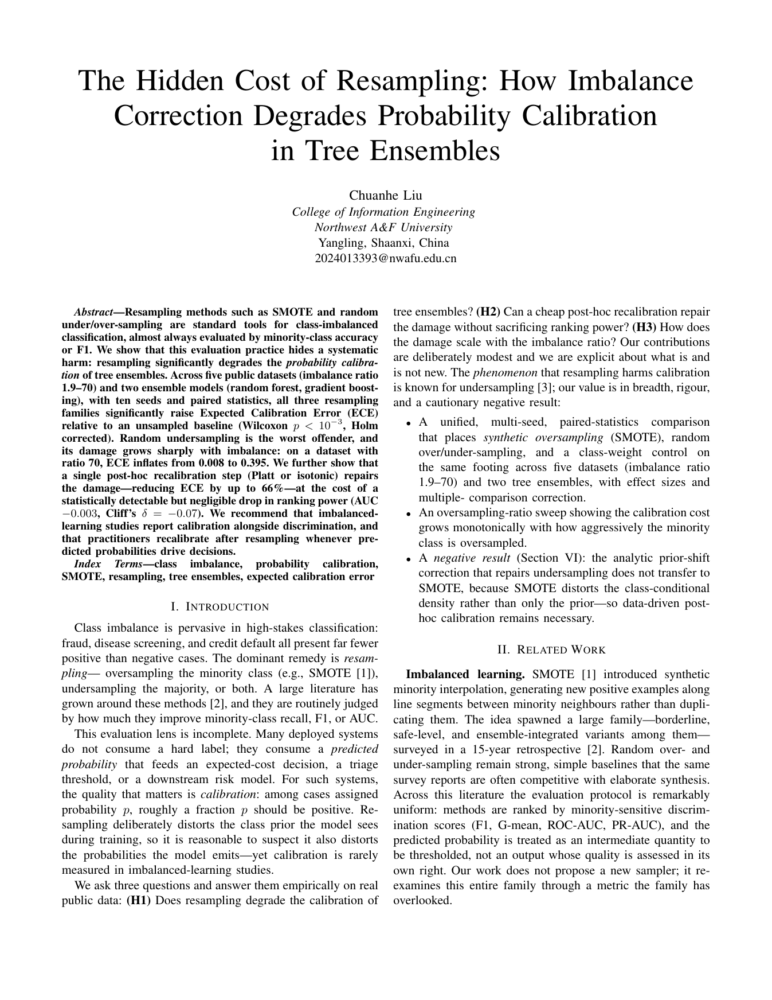
  </a><br>
  <sub>点击论文首页预览打开完整 PDF · <a href="projects/resampling-calibration-study/paper/main.pdf">阅读 PDF</a> · <a href="projects/resampling-calibration-study/paper/main.tex">LaTeX 源码</a></sub>
</p>

- **5** 个 OpenML 数据集(不平衡比 1.9–70)· **2** 个树集成 · **7** 种处理 · **10** 个随机种子 · 配对统计检验
- 核心发现:重采样(SMOTE/过采样/欠采样)会**系统性破坏概率校准**,而 F1/AUC 等常看的指标几乎不动——所以这个代价是"隐形"的
- 一步事后校准可把 ECE 降约 66%,AUC 仅损 0.003

> 这个项目还推动了技能包自身的进化:它如实承认核心结论与前作重叠,并据此强化了 idea/审稿/自审环节的"新颖性撞车检查"。完整经过见[项目 README](projects/resampling-calibration-study/README.md)。

## 📊 图表展示

`light-figure-drawing` 的出版级图表能力——九种对标顶刊的图型,从冲积漏斗到 Kaplan-Meier 生存曲线。**这组是视觉能力展示,数据为脚本合成的演示数据**(每图右下角已标注),一键复现见 [`assets/gallery/make_showcase.py`](assets/gallery/make_showcase.py);真实数据驱动的九图见上方[案例展示](#-案例展示一篇用-light-从头做到底的论文)。配色走色盲安全的 Okabe-Ito 色板,300 dpi 出版级导出。

<table>
  <tr>
    <td align="center" width="33%">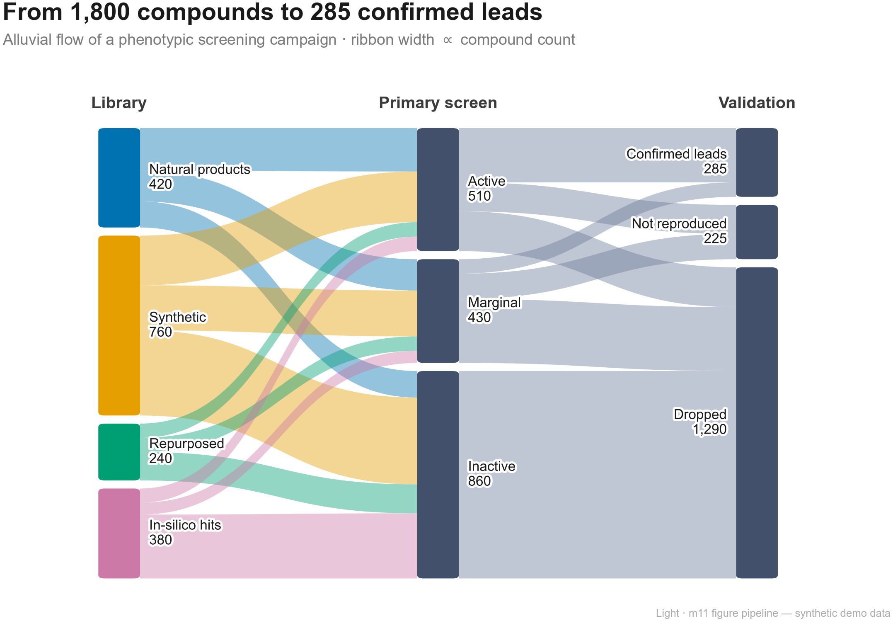<br><sub>🌊 筛选漏斗冲积图</sub></td>
    <td align="center" width="33%">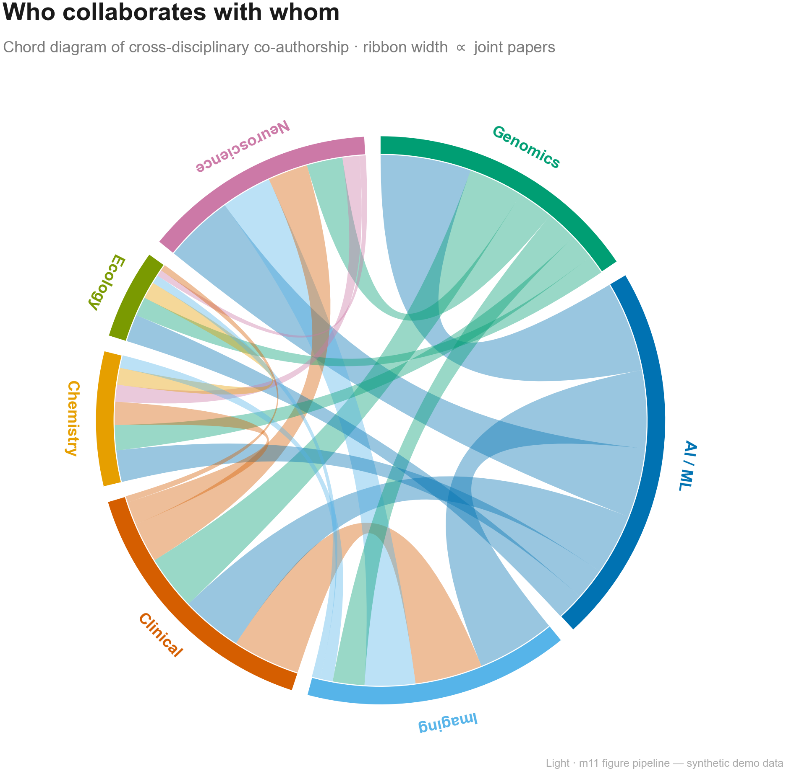<br><sub>🎼 跨学科合作和弦图</sub></td>
    <td align="center" width="33%">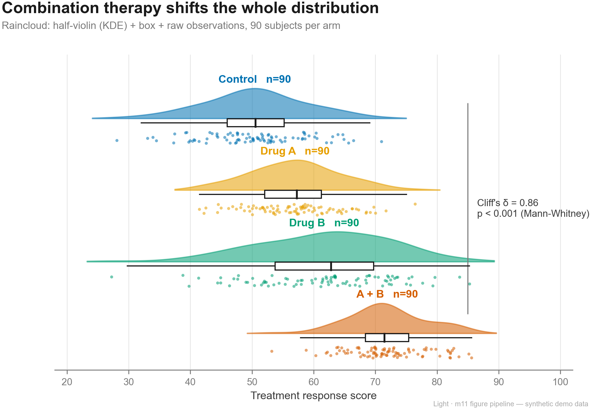<br><sub>🌧 分布对比雨云图</sub></td>
  </tr>
  <tr>
    <td align="center" width="33%">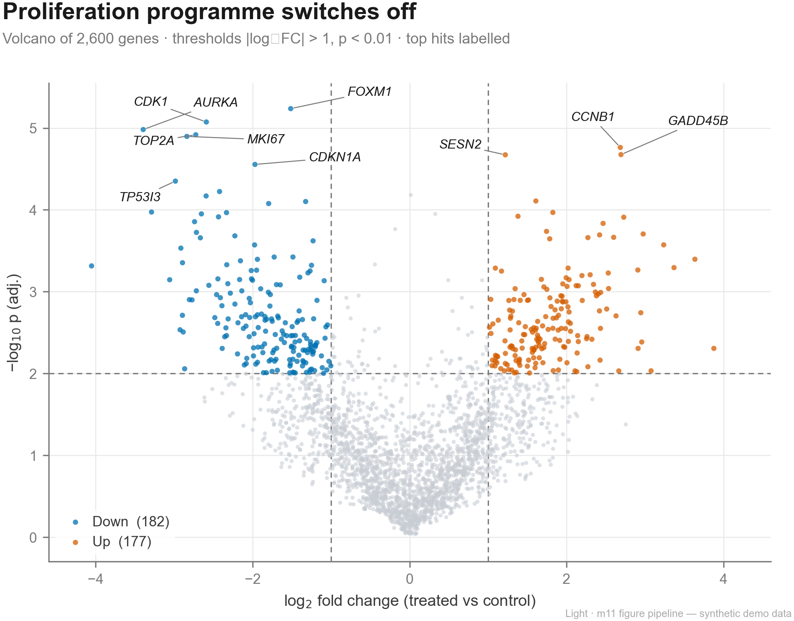<br><sub>🌋 差异表达火山图</sub></td>
    <td align="center" width="33%">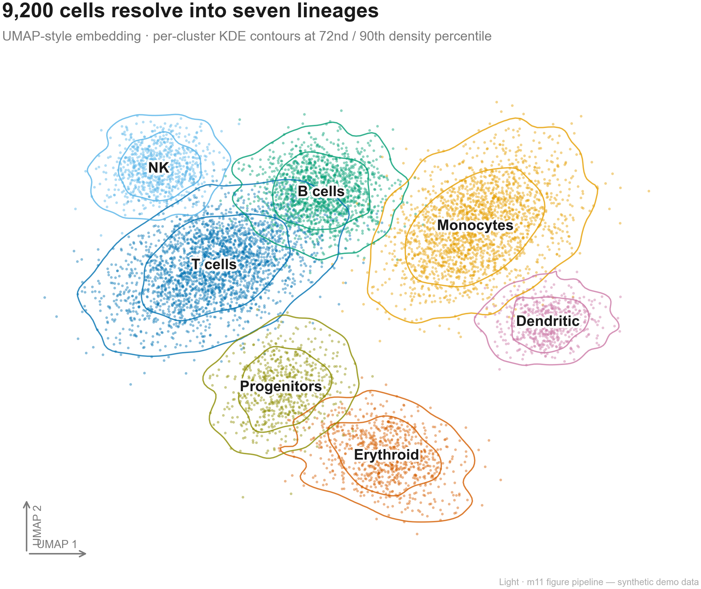<br><sub>🔬 单细胞 UMAP 嵌入</sub></td>
    <td align="center" width="33%">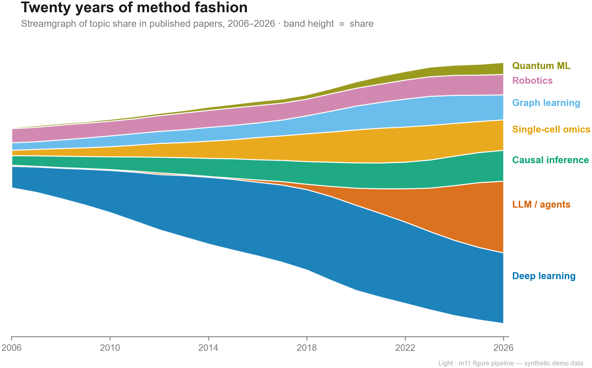<br><sub>📊 主题演化流图</sub></td>
  </tr>
  <tr>
    <td align="center" width="33%">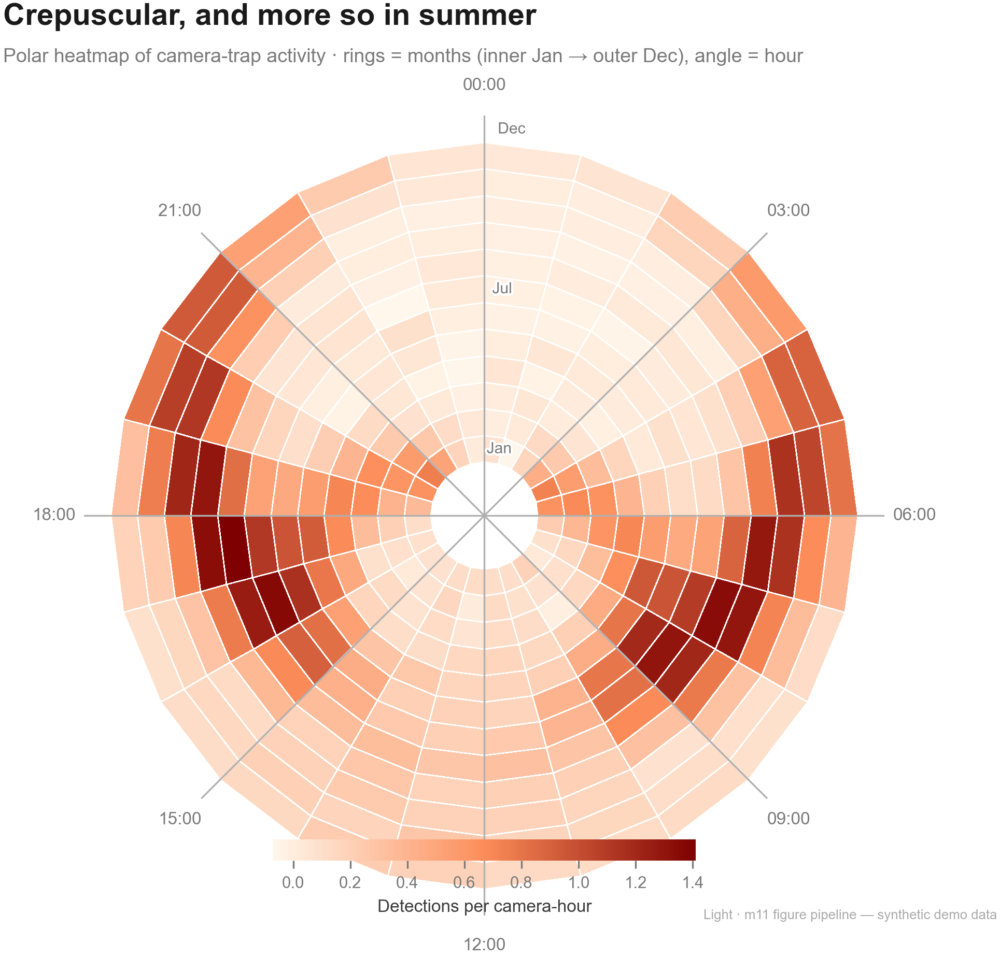<br><sub>🎯 昼夜节律极坐标热图</sub></td>
    <td align="center" width="33%">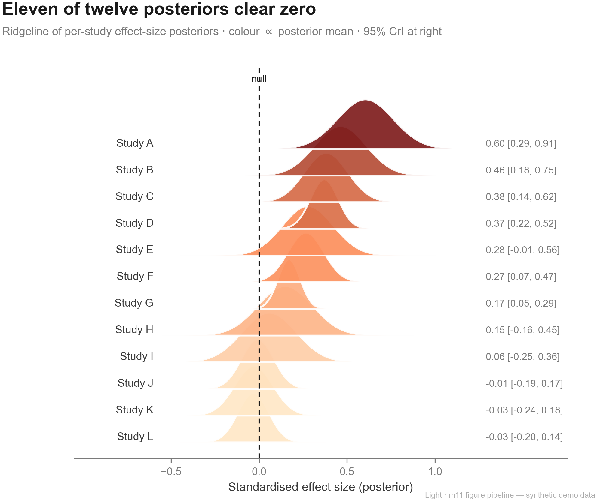<br><sub>🏔 效应量后验山脊图</sub></td>
    <td align="center" width="33%">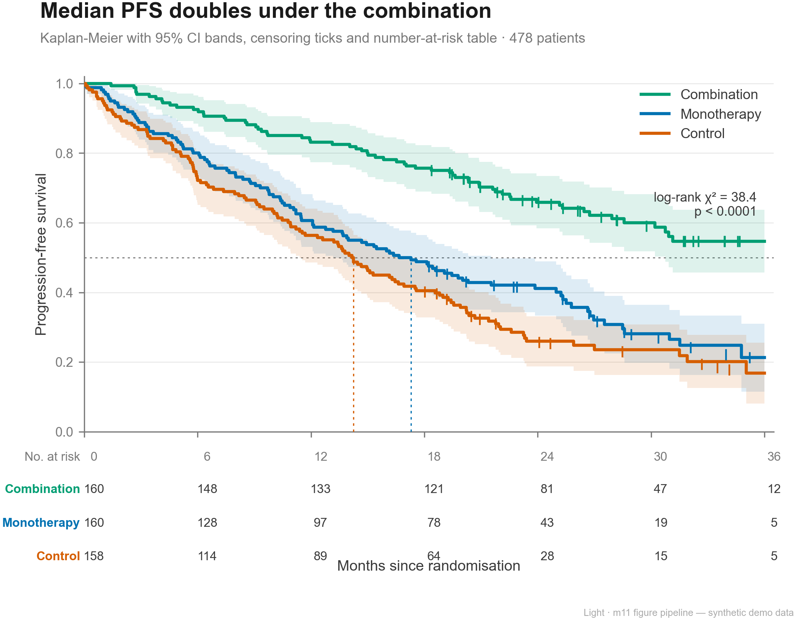<br><sub>📉 Kaplan-Meier 生存曲线</sub></td>
  </tr>
</table>

## 📚 知识库

技能背后垫着 9 个共享知识库(`databases/`),内容均经核查、可溯源:

| 库 | 内容 |
|----|------|
| [`db01` 期刊会议](databases/db01-venues-templates/README.md) | 期刊/会议元数据、审稿周期、代表作、分层(含真实 ISSN 与替代指标) |
| [`db02` 模板](databases/db02-paper-writing/README.md) | 各阶段产出的可套用模板 |
| [`db03` 方法](databases/db03-methods/README.md) | 方法卡:任务/输入输出/优劣/基线/评测/代表作与实现仓库 |
| [`db04` 数据集](databases/db04-datasets/README.md) | 数据集卡:规模/许可/已知问题/下载方式 |
| [`db05` 设计系统](databases/db05-frontend-styles/README.md) | 前端/可视化设计规范 |
| [`db06` 幻灯主题](databases/db06-ppt-styles/README.md) | PPT 主题与配色 |
| [`db07` 科研图表](databases/db07-figures/README.md) | 顶刊顶会图表案例:审美/布局/配色/组图逻辑 |
| [`db08` 知识产权与竞赛](databases/db08-ip-materials/README.md) | 软著专利、竞赛申报材料骨架与评审维度 |
| [`db09` 项目状态](databases/db09-projects/README.md) | 跨会话项目记忆:项目卡/术语表/决策日志 |

另有 `code_assets/` 收录经对抗验证的统计与指标代码(一致性 κ/QWK 对照 `sklearn`,Welch t/BH-FDR/Wilson 对照 `scipy`,MOTA/IDF1、CORAL 序数损失、长尾重采样),数值与权威库逐位对齐,并由 CI 持续校验。

## 🔑 关于 API key

> [!NOTE]
> **绝大多数功能开箱即用,无需任何 API key。** 文献检索默认走免费的 OpenAlex / Crossref;OpenAlex 2026 年起官方要求注册**免费** API key(匿名访问处于过渡期仍可用),建议花两分钟注册以免限流。

只有两种情况需要你自备 key:① 用 `light-ip-application` 做**专利检索**,调用商用专利库需要各自的凭证;② 给 `light-slides` 解锁 **PPT 生图流水线**(`imggen-enhanced` 模式,强烈建议但完全可选,不配置自动走程序化路线)。Light **不内置、也不会替你保存任何 key**,只在你提供时才发起请求。

| 服务 | 用途 | 是否必需 | 怎么获取 |
|------|------|----------|----------|
| OpenAlex / Crossref | 学术文献检索 | 免费,默认 | Crossref 无需注册;OpenAlex 官网免费注册 key(建议) |
| 生图模型(GPT Image 2 / Nanobanana 2 / Seedream 5.0 任一) | PPT 生图流水线(`imggen-enhanced`) | 选用,强烈建议 | OpenAI / Google AI Studio / 火山方舟,按张计费 |
| [The Lens](https://www.lens.org/lens/user/subscriptions#scholar) | 专利↔论文关联检索 | 选用 | 注册申请,学术用途多数免费授权 |
| [EPO OPS](https://developers.epo.org/) | 欧洲专利官方数据 | 选用 | 注册拿 consumer key/secret |
| [USPTO ODP](https://developer.uspto.gov/) | 美国专利数据 | 选用 | 注册申请 API key |

key 通过环境变量提供,不要写进代码或提交到仓库。Light 的安全约定见 [SECURITY.md](SECURITY.md)。

## 🎯 设计理念

- **诚实优先** — 不编造文献、数据、出处、数据来源;核不实的明确标注"待核查",并区分"已验证"与"推测";受版权材料只保留元数据与链接。
- **能跑,不空谈** — 技能内置真实可运行的脚本、可套用的模板、完整的范例,而非一段段抽象指令。
- **对抗式自检** — 关键产出都经过独立"挑刺"和权威工具的交叉验证(统计结果对照 `scipy`/`sklearn`,对外接口逐一实测)。
- **全流程协同** — 28 个技能围绕一条科研主线衔接,共享 9 个知识库的术语、方法与投稿信息。

## 🗂️ 目录结构

```
Light-skills/
├── skills/             # 28 个技能,每个含 SKILL.md + references,按需带 scripts/templates/examples
├── databases/          # 9 个知识库(db01–db09)
├── code_assets/        # 经对抗验证、CI 持续校验的统计与指标代码
├── projects/           # 端到端示例项目(dairygoat-detect-track,跑通完整链路)
├── evals/              # 行为评测黄金集(44 任务 + Tier1 基线分,季度滚动)
├── _verification_log/  # 二次核实证据链(API 字段/库行为/技能来源,带真实 HTTP 码)
├── assets/             # LOGO、链路图、社交预览(含可复现生成脚本)
├── install.ps1 / .sh   # 一键安装脚本(幂等可重跑)
├── CONVENTIONS.md      # 全局规约(诚实底线、产出规范)
├── ROUTER.md           # 技能路由逻辑
├── ROUTER_EXAMPLES.md  # 路由样例回归集（防止继续/断点恢复/图表边界等入口漂移）
├── AGENTS.snippet.md   # Codex 路由片段
├── .claude-plugin/     # Claude 插件清单(plugin.json)
├── .codex-plugin/      # Codex 插件清单
├── CONTRIBUTING.md · CODE_OF_CONDUCT.md · SECURITY.md   # 贡献/行为准则/安全策略
├── CHANGELOG.md · CITATION.cff · LICENSE                # 更新日志/引用信息/许可
├── README.md · README.en.md                            # 中 / 英文档
├── .github/            # issue/PR 模板、CI、赞助配置
└── .codex/INSTALL.md   # Codex 安装说明
```

## ❓ 常见问题

<details>
<summary><b>对话太长上下文不够了怎么办?</b></summary>

Light 有**会话衔接协议**:当上下文将尽或一段任务收尾,它会主动给你两件套——把当前状态写成一张自包含的衔接卡(落在项目 `.light/handoff/` 下),并打印一段中文"新对话启动提示词"。你复制提示词、开个新对话粘贴进去,下一个 Light 只读最新衔接卡就能无缝接上"做到哪、下一步是什么",还能沿衔接链追到任意上级对话。提示词第一行会建议把对话命名为 `[项目] S04 ...` 这样的编号,让对话列表天然有序。也可以随时说"给我衔接提示词"主动触发。
</details>

<details>
<summary><b>它和直接用 ChatGPT/Claude 聊有什么区别?</b></summary>

Light 给的是能跑的脚本、能套的模板和真实范例,且有"不编造"的硬底线和对抗式自检;还能跨会话记住你的项目进度。不是一次性问答。
</details>

<details>
<summary><b>需要配置 API key 吗?</b></summary>

绝大多数功能免 key,文献检索默认走免费的 OpenAlex / Crossref(OpenAlex 建议注册免费 key,见 2026 新政说明)。需要自备 key 的只有两类:专利检索(Lens/EPO/USPTO)与可选的 PPT 生图模型。详见 [关于 API key](#-关于-api-key)。
</details>

<details>
<summary><b>常驻技能为什么在 <code>/</code> 里看不到?</b></summary>

这 11 个技能设计为后台自动生效,无需手动唤起,所以不占用 `/` 菜单。17 个手动技能则照常用 `/` 调用。
</details>

<details>
<summary><b>必须两端都装吗?</b></summary>

不必。`install.ps1 -Client claude` 或 `install.sh claude` 只装一端。
</details>

<details>
<summary><b>会把我的数据上传到第三方吗?</b></summary>

不会,除非任务本身需要(如检索文献会访问公开学术 API)。涉及上传的操作会提示。详见 [SECURITY.md](SECURITY.md)。
</details>

<details>
<summary><b>Light 会替我写论文、造数据吗?</b></summary>

不会。它辅助你做研究、组织表达,但严守学术伦理(见 `light-research-ethics`):不造数据、不编文献、不过度包装。
</details>

## 🤝 参与贡献

欢迎修 bug、加技能、扩知识库、改文档。请先读 [CONTRIBUTING.md](CONTRIBUTING.md) 与 [CONVENTIONS.md](CONVENTIONS.md)(尤其是诚实底线),并遵守 [CODE_OF_CONDUCT.md](CODE_OF_CONDUCT.md)。安全问题请按 [SECURITY.md](SECURITY.md) 私下报告。

**维护节律**：数据卡保鲜由 `.github/workflows/freshness.yml` 每月 1 日定时检查，有超期条目自动开"数据卡保鲜清单"issue；也可在 Actions 页手动 "Run workflow"（GitHub 对不活跃仓库 60 天会停定时、fork 默认禁用定时，故手动入口是兜底）。技能行为质量由 `evals/`（季度跑黄金任务记基线，详见 [evals/README.md](evals/README.md)）把关——它与结构校验器（CI）分工：CI 验"结构对不对"，evals 验"行为好不好"。

## ❤️ 支持与鼓励

Light 由一个人利用业余时间打磨。如果它帮你省下了时间、让科研更顺手,欢迎请作者喝杯咖啡——你的支持是持续更新的最大动力。

<div align="center">


*微信扫码,金额随意,心意已收到 🙏*
</div>

## 💬 反馈与建议

- **问题反馈 / 功能建议**:在本仓库提 [Issue](https://github.com/Light0305/Light-skills/issues)(有 bug / 功能模板)
- **使用交流**:欢迎到 [Discussions](https://github.com/Light0305/Light-skills/discussions)
- **改进贡献**:Fork 后提 Pull Request
- **邮件联系**:1833058953@qq.com

## 📈 Star 趋势

[](https://star-history.com/#Light0305/Light-skills&Date)

## 📌 引用

如果 Light 对你的研究有帮助,可按 [CITATION.cff](CITATION.cff) 引用,或在 GitHub 仓库页点击 "Cite this repository"。

## 📄 许可

[MIT License](LICENSE) © 2026 Light

---

<div align="center">
<sub>用 Light 把想法照进论文 · Made with care for researchers</sub>
</div>
