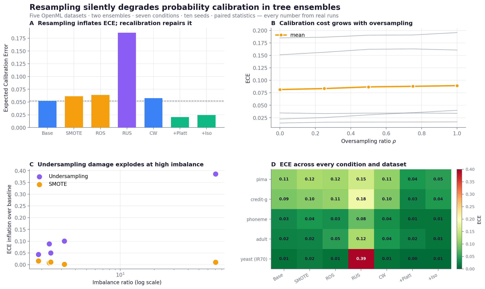

# Resampling Silently Degrades Probability Calibration in Tree Ensembles

[](paper/main.pdf)
[](paper/main.pdf)
[](figures/)
[](data/processed/)
[](#-复现)

> 一篇**完全用 [Light](../../README.md) 技能包从零做到底**的端到端实证研究：找文献 → 提 idea → 对抗严审 → 跑实验 → 出图 → 写成 6 页 IEEE 论文。**所有数字都来自真实运行，不造一个数据。**

## 📄 论文展示

**[📖 阅读完整 IEEE PDF 论文](paper/main.pdf)** · [Raw PDF](https://raw.githubusercontent.com/Light0305/Light/master/projects/resampling-calibration-study/paper/main.pdf) · [LaTeX 源码](paper/main.tex)

<p align="center">
  <a href="paper/main.pdf">
    
  </a>
</p>

<p align="center"><sub>点击论文首页预览即可打开完整 PDF</sub></p>

## TL;DR

重采样(SMOTE、随机过/欠采样)是处理类别不平衡的标准做法，几乎总是用 F1 或 AUC 来评判。本研究揭示它们有个隐形代价：会**系统性破坏树集成的概率校准**，而实践者常看的判别指标几乎不动甚至变好——所以这个代价在标准评估下完全看不见。

- **5** 个 OpenML 数据集(不平衡比 1.9–70)· **2** 个树集成 · **7** 种处理 · **10** 个随机种子 · 配对统计检验
- 所有重采样族都显著抬高 ECE(Wilcoxon *p* < 10⁻³，Holm 校正)
- 欠采样最糟，且随不平衡比急剧恶化：IR=70 时 ECE 从 0.008 飙到 0.395
- 一步事后校准可把 ECE 降约 66%，AUC 仅损 0.003

## 📊 图表展示

<table>
  <tr>
    <td align="center" width="50%">
      <b>① 重采样抬高 ECE，校准修复它</b><br>
      <br>
      <sub>七种处理的 ECE：重采样族全部高于基线，事后校准压到最低</sub>
    </td>
    <td align="center" width="50%">
      <b>② 损害随不平衡比急剧放大</b><br>
      <br>
      <sub>欠采样的校准误差在高不平衡比下爆炸式增长</sub>
    </td>
  </tr>
  <tr>
    <td align="center" width="50%">
      <b>③ 代价随过采样幅度单调上升</b><br>
      <br>
      <sub>合成少数类越多，校准误差越大</sub>
    </td>
    <td align="center" width="50%">
      <b>④ 特征归因被保留，只有概率标度受损</b><br>
      <br>
      <sub>基线 vs SMOTE 的 SHAP 重要性几乎一致(Spearman ρ=0.96)</sub>
    </td>
  </tr>
</table>

<p align="center">
  <br>
  <sub>四面板总览：柱状 / 折线 / 对数散点 / 热力图——一图读完整个故事</sub>
</p>

## 📂 项目内容

| 路径 | 内容 |
|------|------|
| [`paper/main.pdf`](paper/main.pdf) | 6 页 IEEE 论文(编译零错误：6 图 5 表 8 条已核验引用) |
| [`paper/main.tex`](paper/main.tex) · [`paper/refs.bib`](paper/refs.bib) | LaTeX 源码与文献库 |
| [`src/`](src/) | 数据获取、主实验、ρ 扫描、SHAP、先验校正、绘图脚本 |
| [`experiments/`](experiments/) | 原始结果：700 行主网格、250 行 ρ 扫描、SHAP 偏移、E5 先验校正 |
| [`data/processed/`](data/processed/) | 5 个预处理好的 OpenML 数据集(parquet) |
| [`docs/`](docs/) | 各阶段记录：文献综述、idea、严审判决、计划、数据集卡、结果分析 |

## 🔁 复现

```bash
pip install numpy pandas scikit-learn matplotlib scipy shap
python src/fetch_data.py          # 拉取并预处理 5 个 OpenML 数据集
python src/run_experiments.py     # 主网格 700 行
python src/run_rho_sweep.py       # E4：过采样比扫描
python src/run_prior_correct.py   # E5：解析先验校正(负结果)
python src/run_shap.py            # SHAP 特征归因偏移
python src/make_figures.py && python src/make_figures_extra.py && python src/make_showcase.py
cd paper && pdflatex main && bibtex main && pdflatex main && pdflatex main
```

## 🪞 诚实复盘：Light 在这个项目里暴露并修复了自己的短板

这篇论文最有价值的产出，其实不是论文本身。它的**核心结论与前人工作高度重叠**(Dal Pozzolo 2015 已专门研究欠采样破坏校准)，而这一点直到接近完稿才被检索出来——立项时新颖性被高估为约 70，实际只有 35–45。

我们没有掩盖这件事，而是把它转化成对技能包的改进。为根除此类"做完才发现撞车"：

- **`idea-generation`**：提 idea 时强制回答四问——有没有人做过同一核心、是不是真缺口、是真创新还是增量、审稿人会用什么理由拒；
- **`idea-critique`**：严审时独立复核核心撞车、对新颖性谎报记红旗、预演拒稿理由；
- **`self-review`**：论文定稿前的核心撞车终检兜底；
- **`paper-drafting`**：补上"论文确实只是增量时，如何诚实地讲好故事"——重定位而非夸大、把负结果变成卖点、把 claim 收缩到证据撑得住的尺度。

论文本身也贯彻了同样的诚实：明确承认前作、如实写出一个**负结果**(解析先验校正对 SMOTE 不奏效，因为 SMOTE 扭曲的是类条件密度而非单纯先验)，而不是假装首创。**技能包通过真刀真枪做项目、并诚实面对不足，变得更可靠。**

> 本项目是 [Light](../../README.md) 科研技能包的端到端案例展示。
